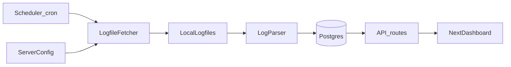

## Fetching DCSS Public Data – High-Level Plan

### 1. Overall architecture
- **Goal**: Periodically download DCSS public server logfiles (xlogfiles) from the same sources used by `dcss-stats`, store them (raw and/or normalized), and make them queryable by your app.
- **Pattern**: Background worker or cron-like job in your backend that:
  - Reads a configured list of DCSS servers and their logfile URLs.
  - Downloads or increments existing local copies.
  - Parses new lines into a Postgres table.
  - Exposes the data via API endpoints your Next.js dashboard can call.

A simple flow:

### 2. Identify and model data sources
- **Reuse dcss-stats server list**: Start from the `seedData.ts` `servers` array in `dcss-stats`, which lists all public servers and logfile paths.
  - Convert that into a local config structure (JSON, TS, or DB table) with:
    - `name`, `abbreviation`, `baseUrl`, `logfiles[]` (`path`, `version`, optional `morgueUrlPrefix`).
- **Decide scope**:
  - Minimal viable: pick a subset of servers (e.g., `crawl.dcss.io`, `archive.nemelex.cards`) and only recent versions (e.g., 0.30+ and trunk) to keep volume reasonable.
  - Optionally include morgue/ttyrec URLs if you later want richer details.

### 3. Storage strategy
- **Database schema (normalized path)**:
  - Similar to `dcss-stats` `schema.prisma` but you can start smaller:
    - `Server(id, name, abbreviation, baseUrl, morgueUrl, ttyrecUrl, isDormant)`
    - `Logfile(id, serverId, path, version, lastFetched, bytesRead)`
    - `Game(id, playerName, isWin, startAt, endAt, version, score, xl, race, class, title, endMessage, turns, duration, runes, serverAbbreviation, ...)`
  - If you already have Supabase/Postgres running (as in `snorg-morgue`), extend that schema there.
- **Raw file storage**:
  - Either:
    - Keep raw logfiles on disk (under `logfiles/<server>/<server>-<version>` like `dcss-stats`), *or*
    - Store raw lines in a `RawLogLine` table and treat it as an ingestion buffer.
  - For a Next.js/Supabase setup, storing only parsed `Game` rows is often enough; you can skip long‑term raw file retention once parsing is stable.

### 4. Fetcher: downloading public logfiles
- **Configuration**:
  - Create a small utility like `getRemoteLogPath(server, logfile)` that mirrors `dcss-stats`’s logic: if `path` is absolute (`http...`) use it directly, else prepend `server.baseUrl`.
- **Implementation choices**:
  - Use Node `fetch`/`axios` instead of `wget` for portability (or keep `wget` if you run in a VM/container where it’s available).
  - Implement incremental updating:
    - For each `Logfile`, track `lastFetched` and `bytesRead` in DB.
    - On each run, download the current logfile, compare size, and only parse the new bytes beyond `bytesRead`.
- **Scheduling**:
  - For production: use a real scheduler (e.g., `cron` in your container, Supabase cron, or a hosted job runner) calling a backend endpoint/worker every N minutes.
  - For local/dev: a simple `setInterval` loop in a Node process (similar to `startFetchQueue` in `dcss-stats`) is fine.

### 5. Parser: turning lines into games
- **Line format**:
  - DCSS logfiles use the standard xlogline format: a single line of `key=value` pairs separated by `:`.
- **Parsing steps**:
  - Stream the logfile from disk (or from the HTTP response) line by line.
  - Skip lines up to `bytesRead` (or use a seek/offset if you tracked byte positions).
  - For each new line:
    - Convert to an object `{ [key: string]: string }`.
    - Map keys to your `Game` fields (e.g., `name`, `race`, `class`, `sc`, `xl`, `ktyp`, `killer`, `start`, `end`, `dur`, `turn`, `urune`, etc.).
    - Normalize race/class like `dcss-stats` does if you care about grouping (optional first pass).
    - Upsert into `Game` table keyed by a combination like `(serverAbbreviation, gameId/logfile line hash)` to avoid duplicates.
  - Track parsing position by updating `Logfile.bytesRead` after finishing a batch.
- **Error handling**:
  - Log/collect malformed lines into a lightweight `InvalidGame`/`InvalidLogLine` table for later inspection, similar to `dcss-stats`.

### 6. Background worker orchestration
- **Process model**:
  - Option 1 (simplest): a single Node process that both fetches and parses on an interval:
    - `runCycle()`:
      - For each active `Logfile`, download file (or HEAD to see if size changed).
      - If size increased, parse the new segment.
    - Schedule `runCycle` every few minutes.
  - Option 2 (scalable): separate concerns (like `dcss-stats`):
    - Fetch worker that only keeps local logfiles in sync.
    - Parse worker that continuously scans local files for new content.
- **Queueing**:
  - If volume grows, introduce a simple in‑memory or Redis‑backed job queue so a spike of new data doesn’t block the rest of your app.

### 7. API layer for your site
- **Read‑only endpoints** your Next.js dashboard can hit:
  - `GET /api/games` – filter by server, version, date range, win/loss, player, race/class, etc.
  - `GET /api/players/:name` – show a player’s games and summary stats.
  - `GET /api/summary` – precomputed aggregates (e.g., winrates by race/class, rune stats).
- **Performance**:
  - Add DB indexes on the main query filters (e.g., `playerName`, `endAt`, `versionShort`, `normalizedRace`, `normalizedClass`, `isWin`).
  - Consider materialized views or nightly aggregation jobs once you know which charts/tables you care about most.

### 8. Configuration, secrets, and ops
- **Env variables**:
  - `DATABASE_URL` for your Postgres.
  - `DCSS_FETCH_ENABLED`, `DCSS_PARSE_ENABLED` feature flags so you can disable ingestion without redeploying.
- **Observability**:
  - Basic logging: when each logfile fetch starts/ends, how many new lines were parsed, errors per run.
  - A health endpoint or lightweight admin page showing per‑server `lastFetched` and last successful parse time.

### 9. Migration / rollout strategy
- **Phase 1 – prototype on a subset**:
  - Ingest from a single server (e.g., `crawl.dcss.io`) and a single version (latest stable) for a few days.
  - Build one or two simple charts/tables off that data to verify correctness.
- **Phase 2 – expand coverage**:
  - Add more servers and versions, monitor DB size and performance.
  - Tune fetch cadence and indexes.
- **Phase 3 – productionize**:
  - Move the fetch/parse loop into a proper scheduled job in your hosting environment.
  - Add alerts for persistent failures (e.g., a server’s logfile unreachable for >24h).
