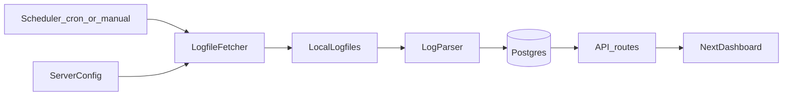

## Fetching DCSS Public Data – High-Level Plan

### 1. Overall architecture
- **Goal**: Fetch DCSS public server data (xlogfiles and morgues) from the same sources used by `dcss-stats`, normalize it, and make it queryable by Snorg.
- **Stages**:
  - **Stage 1 (manual refresh)**:
    - All online imports are triggered explicitly by the user from the UI (Online Import modal).
    - There is **no automatic scheduler** or background polling; scans and imports only run when the user clicks **Scan/Refresh** and **Import**.
  - **Stage 2 (optional auto-sync, future)**:
    - Once Stage 1 is stable, add an optional scheduler that periodically refreshes online data for users who opt in, reusing the same APIs and metadata.
- **Pattern**:
  - Read a configured list of DCSS servers and their logfile/morgue URLs.
  - Use xlogfiles to discover and count games, and morgues to enrich imported games.
  - Store normalized game rows (plus provenance) in Postgres.
  - Expose the data via API endpoints your Next.js dashboard can call.

A simple flow:


### 2. Identify and model data sources
- **Reuse dcss-stats server list**: Start from the `seedData.ts` `servers` array in `dcss-stats`, which lists all public servers and logfile paths.
  - Convert that into a local config structure (JSON, TS, or DB table) with:
    - `name`, `abbreviation`, `baseUrl`, `logfiles[]` (`path`, `version`, optional `morgueUrlPrefix`).
- **Decide scope**:
  - Minimal viable: pick a subset of servers (e.g., `crawl.dcss.io`, `archive.nemelex.cards`) and only recent versions (e.g., 0.30+ and trunk) to keep volume reasonable.
  - Optionally include morgue/ttyrec URLs if you later want richer details.

### 3. Storage strategy
- **Database schema (normalized path)**:
  - Similar to `dcss-stats` `schema.prisma` but you can start smaller:
    - `Server(id, name, abbreviation, baseUrl, morgueUrl, ttyrecUrl, isDormant)`
    - `Logfile(id, serverId, path, version, lastFetched, bytesRead)`
    - `Game(id, playerName, isWin, startAt, endAt, version, score, xl, race, class, title, endMessage, turns, duration, runes, serverAbbreviation, ...)`
  - If you already have Supabase/Postgres running (as in `snorg-morgue`), extend that schema there.
- **Raw file storage**:
  - Either:
    - Keep raw logfiles on disk (under `logfiles/<server>/<server>-<version>` like `dcss-stats`), *or*
    - Store raw lines in a `RawLogLine` table and treat it as an ingestion buffer.
  - For a Next.js/Supabase setup, storing only parsed `Game` rows is often enough; you can skip long‑term raw file retention once parsing is stable.

- **Mixed data sources (online vs manual)**:
  - Snorg will continue to support **manual morgue file uploads** (existing feature) alongside **online‑synced data** from public servers.
  - Each game row must record its **source**, e.g. `source = 'manual_upload' | 'online_sync'`, and any relevant metadata (e.g. `server_abbreviation` and `dcss_username` for online games).
  - This allows the UI and stats to distinguish between games uploaded by the user and games discovered via online sync.

### 3.5. Schema sketch for online sync

At a high level, we expect to extend the existing tables roughly as follows (names subject to change during implementation):

- **`parsed_morgues` (or `games`)**:
  - New columns:
    - `source text not null default 'manual_upload'`
      - `'manual_upload' | 'online_sync'`.
    - `server_abbreviation text`
      - Nullable; set for `online_sync`.
    - `dcss_username text`
      - Nullable; set for `online_sync`.
    - `game_signature text`
      - Non‑null for online games; optional for manual uploads.
  - Suggested indexes:
    - `idx_parsed_morgues_game_signature` on (`game_signature`) where `source = 'online_sync'`.
    - `idx_parsed_morgues_server_user` on (`server_abbreviation`, `dcss_username`).

- **`morgue_files`** (unchanged for now):
  - Still only used for manual uploads (`source = 'manual_upload'`).
  - Online‑synced games will not have a `morgue_file_id`.

- **New tables for metrics (planned)**:
  - `online_import_runs`:
    - `id uuid`, `user_id uuid`, `dcss_username text`,
    - `started_at timestamptz`, `finished_at timestamptz`,
    - `status text` (`'success' | 'partial' | 'failed'`),
    - `error_summary text`.
  - `online_import_server_stats`:
    - `id uuid`, `import_run_id uuid references online_import_runs`,
    - `server_abbreviation text`,
    - `total_games_found int`, `total_games_imported int`, `new_games int`,
    - `error_message text`, `duration_ms int`.

### 4. Fetcher: downloading public logfiles
- **Configuration**:
  - Create a small utility like `getRemoteLogPath(server, logfile)` that mirrors `dcss-stats`’s logic: if `path` is absolute (`http...`) use it directly, else prepend `server.baseUrl`.
- **Implementation choices**:
  - Use Node `fetch`/`axios` instead of `wget` for portability (or keep `wget` if you run in a VM/container where it’s available).
  - Implement incremental updating:
    - For each `Logfile`, track `lastFetched` and `bytesRead` in DB.
    - On each run, download the current logfile, compare size, and only parse the new bytes beyond `bytesRead`.

- **Per‑logfile offsets**:
  - Maintain `bytesRead` (or equivalent offset) per logfile so scans and imports only ever process **new lines** appended since the last run.
  - This offset is global to the logfile, not tied to a particular username, which keeps repeated scans for different users cheap: only new lines are examined.

- **Per‑server status for the UI**:
  - The scan/import APIs must return **per‑server status objects** including:
    - `status`: `"ok" | "skipped" | "error"`.
    - `error_message` if an error occurred (e.g. server unavailable, timeout).
    - Game counts (`total_games_found`, `total_games_imported`, `new_games`).
  - The Online Import modal should surface these per‑server statuses instead of failing the whole operation when one server has issues.

### 4.5. Online Import UI (Phase 1)

- **Entry point**:
  - Add an **Online Import** button on the Morgue screen that opens an Online Import modal.
- **Modal layout**:
  - Username input for a DCSS account name.
    - Stage 1: free text field for testing; later this can default to the user’s Snorg username and eventually become the canonical mapping.
  - List of online servers derived from the `DCSS_SERVERS` config:
    - Shows name, abbreviation, versions, and status (e.g., “Not scanned yet”, “5 games found”, “Last scanned at …”).
    - Stage 1 can assume all servers are scanned/imported; per‑server selection can be added later.
  - Footer actions:
    - **Scan** button (primary) for first‑time use, enabled when username is non‑empty.
    - **Import** button, initially disabled until a scan has completed and at least one server has games.
    - Cancel/Close button to dismiss the modal.
- **Scan behavior (first scan)**:
  - Clicking **Scan** calls a backend endpoint (e.g. `POST /api/online-import/scan`) with the username.
  - The backend:
    - Scans each configured server’s xlogfiles to count games for that username.
    - Stores per‑user, per‑server scan metadata, e.g. `dcss_username`, `server_abbreviation`, `total_games_found`, `total_games_imported`, `last_scan_at`, `last_import_at`.
  - The response returns counts per server so the UI can show “X games found” and enable the **Import** button.
  - The UI should show per‑server results:
    - Successful servers with game counts.
    - Servers that were **skipped** (e.g., marked dormant).
    - Servers that returned **errors**, with short, human‑readable messages (e.g., “CDO unavailable, skipped this run.”).
- **Import behavior (after scan)**:
  - Clicking **Import** calls a backend endpoint (e.g. `POST /api/online-import/import`) with the username (and optionally selected servers).
  - The backend:
    - For each server where `total_games_found > total_games_imported`, identifies new games for that username from xlogfiles.
    - Fetches corresponding raw morgue files, parses them with the existing morgue parser, and stores normalized rows.
    - Updates `total_games_imported` and `last_import_at` per server.
  - The UI shows a concise summary (e.g., “Imported 20 new games from CDI, 5 from CDO”) and can close the modal and/or refresh the Morgue view.
  - The UI should again show per‑server results (including any errors) so the user knows exactly what happened on each server.
- **Refresh vs Scan**:
  - After a successful first scan for a given Snorg user + DCSS username:
    - Opening the modal again pre‑populates the username and shows existing scan/import metadata per server.
    - The **Scan** button is replaced by **Refresh**, which re‑scans only for **new games since the last import**.
      - Backend uses `last_import_at` per server as a lower bound so “new games” are effectively `total_games_found - total_games_imported`.
    - The **Import** button remains enabled only if there are new games on at least one server; otherwise it is disabled with helper text such as “No new games since last import”.

### 5. Parser: turning lines into games
- **Line format**:
  - DCSS logfiles use the standard xlogline format: a single line of `key=value` pairs separated by `:`.
  - Xloglines provide compact per‑game summaries (name, race, class, version, score, XL, turns, duration, place, killer, ktyp, runes, timestamps) and are ideal for discovery and counting.
  - Detailed analysis (branches, message history, Ignis detection, Lair:5, etc.) continues to come from full morgue files, which Snorg already parses.
- **Parsing steps**:
  - Stream the logfile from disk (or from the HTTP response) line by line.
  - Skip lines up to `bytesRead` (or use a seek/offset if you tracked byte positions).
  - For each new line:
    - Convert to an object `{ [key: string]: string }`.
    - Map keys to your `Game` fields (e.g., `name`, `race`, `class`, `sc`, `xl`, `ktyp`, `killer`, `start`, `end`, `dur`, `turn`, `urune`, etc.).
    - Normalize race/class like `dcss-stats` does if you care about grouping (optional first pass).
    - Upsert into `Game` table keyed by a combination like `(serverAbbreviation, gameId/logfile line hash)` to avoid duplicates.
  - Track parsing position by updating `Logfile.bytesRead` after finishing a batch.
- **Error handling**:
  - Log/collect malformed lines into a lightweight `InvalidGame`/`InvalidLogLine` table for later inspection, similar to `dcss-stats`.

### 5.5. Game identity and signatures

- **Stable game identity**:
  - There is no built‑in global game ID in xlogfiles, so we derive a **`game_signature`** string per game to ensure idempotent inserts and safe re‑imports.
  - Suggested signature inputs:
    - `server_abbreviation`
    - `dcss_username` (from xlog `name`)
    - End timestamp (e.g. xlog `end` or equivalent, normalized to PST)
    - Version (e.g. `v` or `version`)
    - Score (`sc`) and/or XL (`xl`)
  - The exact recipe can be:
    - `game_signature = hash(server_abbreviation + "|" + name + "|" + end + "|" + version + "|" + sc)`
- **Usage**:
  - `game_signature` should be **unique per logical game** and stored on the game row.
  - On import:
    - If a `game_signature` already exists for a given user + server, treat the game as already imported and skip it.
    - This makes re‑scans and re‑imports safely idempotent even if xloglines are replayed or timestamps wobble slightly.

- **Manual vs online duplicates**:
  - It is possible for the same logical game to appear both as:
    - A manual upload (existing feature), and
    - An online‑synced game from the public servers.
  - Duplicate handling policy:
    - If an import (online or manual) encounters a game whose `game_signature` already exists for that user, the importer:
      - Skips inserting a new row.
      - Records the duplicate in the **post‑import report** (per server and per file), so the user can see which games were skipped and why.
    - If the user wants to “replace” an older version of a game (e.g. switch from manual to online or vice versa), they can:
      - Manually delete the existing game row in the UI.
      - Re‑run the import; the game will then be treated as new.

### 6. Background orchestration

- **Stage 1 – manual, user‑triggered only**:
  - No scheduler or cron job; all work is initiated explicitly from the UI.
  - **Scan/Refresh**:
    - Calls an on‑demand scan function that:
      - Reads the configured server list.
      - Scans current xlogfiles for the requested username (mostly on new lines thanks to `bytesRead`).
      - Updates per‑server scan metadata and returns counts and statuses to the client.
  - **Import**:
    - Calls an on‑demand import function that:
      - Uses scan metadata and/or xloglines to identify new games.
      - Downloads raw morgue files for those games, parses them, and stores normalized rows (with provenance).
      - Updates per‑server import metadata.
- **Stage 2 – optional automatic scheduler (future)**:
  - Later, introduce a scheduled job that periodically triggers the same scan/import logic for users who opt in.
  - At that point it may make sense to:
    - Separate “fetch” and “parse” workers for scalability (similar to `dcss-stats`).
    - Introduce a simple in‑memory or Redis‑backed queue if ingestion volume becomes high.

### 7. API layer for your site
- **Read‑only endpoints** your Next.js dashboard can hit:
  - `GET /api/games` – filter by server, version, date range, win/loss, player, race/class, etc.
  - `GET /api/players/:name` – show a player’s games and summary stats.
  - `GET /api/summary` – precomputed aggregates (e.g., winrates by race/class, rune stats).
- **Performance**:
  - Add DB indexes on the main query filters (e.g., `playerName`, `endAt`, `versionShort`, `normalizedRace`, `normalizedClass`, `isWin`).
  - Consider materialized views or nightly aggregation jobs once you know which charts/tables you care about most.

### 7.5. API contracts for scan/import

- **`POST /api/online-import/scan`**:
  - Request body:
    - `dcssUsername: string`
  - Response:
    ```json
    {
      "dcssUsername": "SomePlayer",
      "servers": [
        {
          "serverAbbreviation": "CDI",
          "status": "ok",
          "totalGamesFound": 42,
          "totalGamesImported": 10,
          "newGames": 32,
          "lastScanAt": "2026-03-12T10:15:00-08:00",
          "lastImportAt": "2026-03-11T09:00:00-08:00",
          "errorMessage": null
        },
        {
          "serverAbbreviation": "CDO",
          "status": "error",
          "totalGamesFound": 0,
          "totalGamesImported": 0,
          "newGames": 0,
          "lastScanAt": null,
          "lastImportAt": null,
          "errorMessage": "Server unavailable (timeout)"
        }
      ]
    }
    ```

- **`POST /api/online-import/import`**:
  - Request body:
    - `dcssUsername: string`
    - Optional: `servers?: string[]` (list of server abbreviations to import from; defaults to all eligible).
  - Response:
    ```json
    {
      "dcssUsername": "SomePlayer",
      "summary": {
        "totalNewGamesImported": 37,
        "totalDuplicatesSkipped": 5
      },
      "servers": [
        {
          "serverAbbreviation": "CDI",
          "status": "ok",
          "newGamesImported": 20,
          "duplicatesSkipped": 3,
          "errors": []
        },
        {
          "serverAbbreviation": "CDO",
          "status": "error",
          "newGamesImported": 0,
          "duplicatesSkipped": 0,
          "errors": ["Server unavailable (timeout)"]
        }
      ]
    }
    ```

### 8. Configuration, secrets, and ops
- **Env variables**:
  - `DATABASE_URL` for your Postgres.
  - `DCSS_FETCH_ENABLED`, `DCSS_PARSE_ENABLED` feature flags so you can disable ingestion without redeploying.
- **Observability**:
  - Basic logging: when each logfile fetch starts/ends, how many new lines were parsed, errors per run.
  - A health endpoint or lightweight admin page showing per‑server `lastFetched` and last successful parse time.

### 9. Migration / rollout strategy
- **Phase 1 – prototype on a subset**:
  - Ingest from a single server (e.g., `crawl.dcss.io`) and a single version (latest stable) for a few days.
  - Build one or two simple charts/tables off that data to verify correctness.
- **Phase 2 – expand coverage**:
  - Add more servers and versions, monitor DB size and performance.
  - Tune fetch cadence and indexes.
- **Phase 3 – productionize**:
  - Move the fetch/parse loop into a proper scheduled job in your hosting environment (Stage 2).
  - Add alerts for persistent failures (e.g., a server’s logfile unreachable for >24h).

### 10. Constraints and future considerations

- **User identity across servers**:
  - DCSS servers do not share a centralized account system; a username is just a **string per server**.
  - For Stage 1, Snorg defines an “online account” as:
    - “All games under this **username string** across all configured servers.”
  - This is a convenience assumption; it does not guarantee that the same username on different servers is the same person.

- **Timezones and timestamps**:
  - Xloglines and morgue dates use various formats and server‑local timezones.
  - Internally, all timestamps (e.g. game end time, import timestamps) are normalized to **America/Los_Angeles (PST/PDT)** for consistency in Snorg.
  - When building `game_signature` and performing “new since last import” checks, we:
    - Parse external times into a normalized DateTime in PST.
    - Store and compare using this normalized value to avoid subtle ordering issues.

- **Multi‑username future path**:
  - Stage 1: assumes a single DCSS username string per Snorg user in the Online Import modal.
  - Future Stage:
    - Introduce a `dcss_identities` model (e.g. `id`, `user_id`, `server_abbreviation`, `dcss_username`, `is_default`) so users can link different names per server.
    - Update the Online Import UI to let users choose which identity (or combinations) to scan/import.

### 11. Operational considerations

- **Server etiquette, rate limits, and ToS**:
  - Stage 1 concrete limits (initial values, can be tuned later):
    - Per‑user:
      - Maximum **3** scan+import runs per Snorg user per rolling hour.
      - Minimum **10 minutes** between scans for the same `dcss_username`.
    - Per‑server:
      - Online imports process **one server at a time** in the order shown in the UI.
      - At most **1–2 concurrent HTTP requests** per server during scanning/import.
    - If limits are exceeded:
      - APIs return a 429‑style error with a friendly message (“Too many imports, please wait a few minutes and try again.”).
  - These values are intentionally conservative to avoid overloading community servers; we can relax or tighten them based on real‑world metrics.

- **Import execution model and UX feedback**:
  - Long‑running imports should provide **continuous feedback** in the Online Import modal:
    - Imports process **one server at a time**, moving top‑to‑bottom through the server list.
    - The modal shows, per server:
      - Current status: “queued”, “scanning”, “importing”, “done”, or “error”.
      - A simple counter such as `currently processing game X of Y` while importing.
    - Overall progress indicator:
      - e.g. “Server 2 of 5” and “Imported 37 / 120 new games so far”.
  - For now, imports can be handled synchronously (user waits with modal open); if this proves too slow in practice, we can promote the import operation to a background job with polling.

- **Security and abuse prevention**:
  - Because Stage 1 allows scanning **any username string**, basic safeguards are required:
    - Rate‑limit scan/import endpoints per Snorg user and/or IP (see limits above).
    - Log abusive patterns:
      - Excessive scans across many random usernames.
      - Repeated scans that consistently return 0 games.
    - Optionally block or slow down users that exceed thresholds, and surface friendly error messages (“Too many scans, please wait a few minutes and try again.”).
  - All online imports should be authenticated to a real Snorg user account so we can attribute usage.

- **Testing and fixtures**:
  - Create a small suite of **test fixtures** for:
    - Sample xloglines across multiple versions and servers (including edge cases).
    - Corresponding morgue files for a selected subset of games (wins, deaths, portal vaults, Lair:5, Ignis, etc.).
  - Use these fixtures to:
    - Validate the xlog parsing, signature computation, and “new games” detection.
    - Verify consistency between xlog‑derived and morgue‑derived fields for key stats.
    - Regression‑test the Online Import flow (scan and import) without hitting real servers.

- **Import metrics and observability**:
  - Store basic metrics for each import run in the `online_import_runs` and `online_import_server_stats` tables.
  - Use these metrics to:
    - Display friendly summaries in the UI after each run.
    - Debug performance and error patterns over time.
    - Potentially drive future auto‑sync scheduling decisions in Stage 2.
